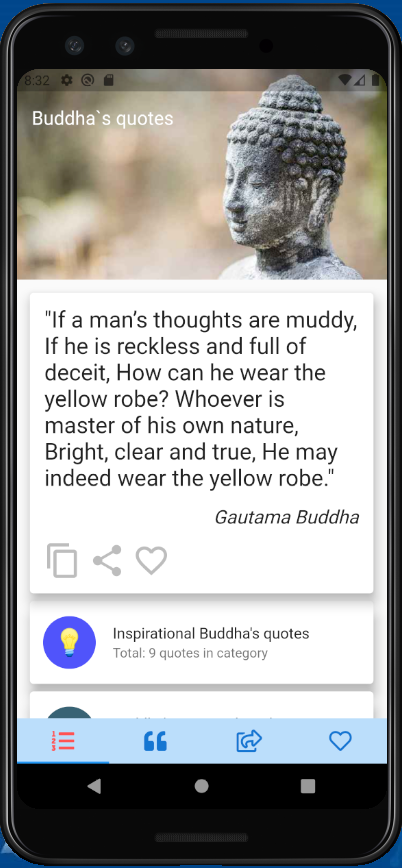
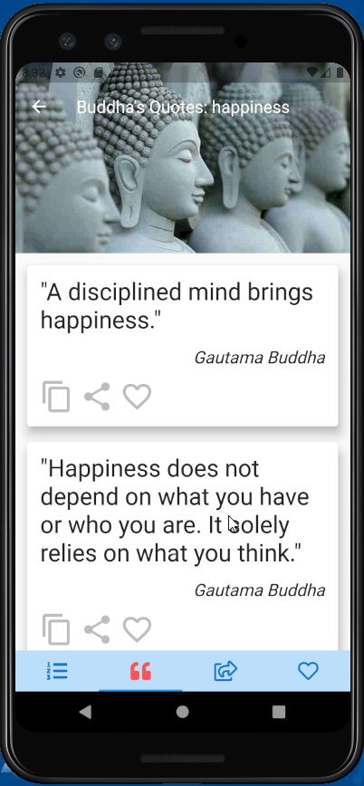
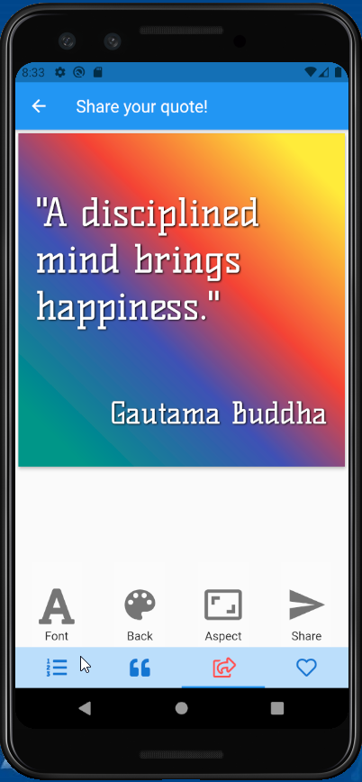
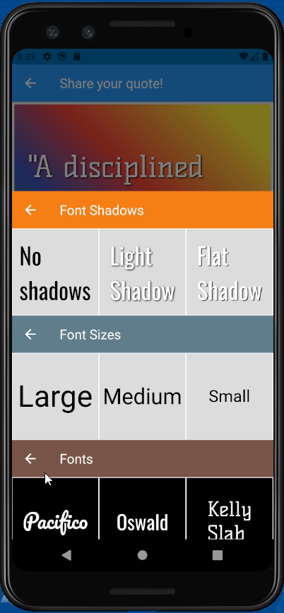
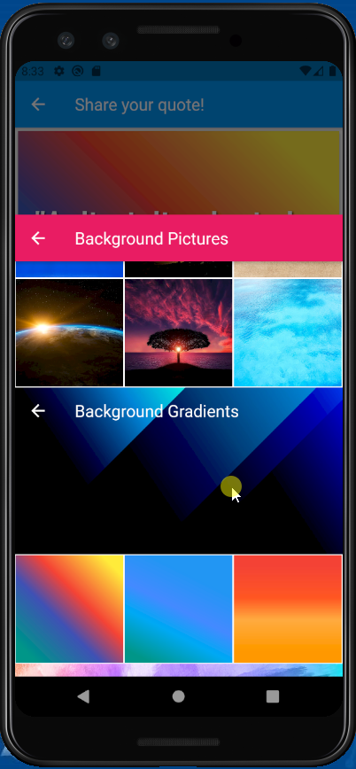
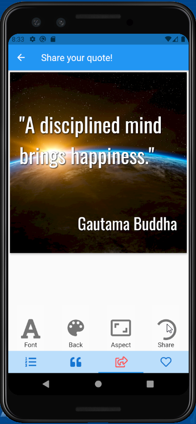
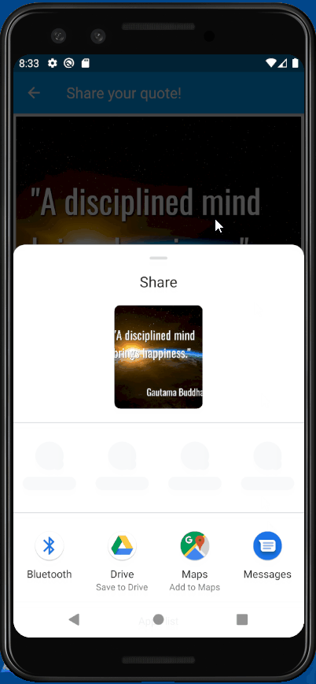
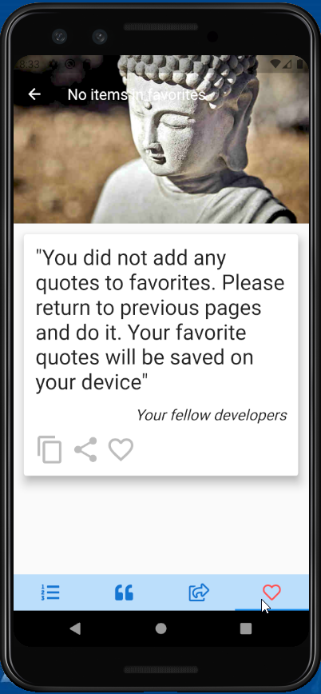
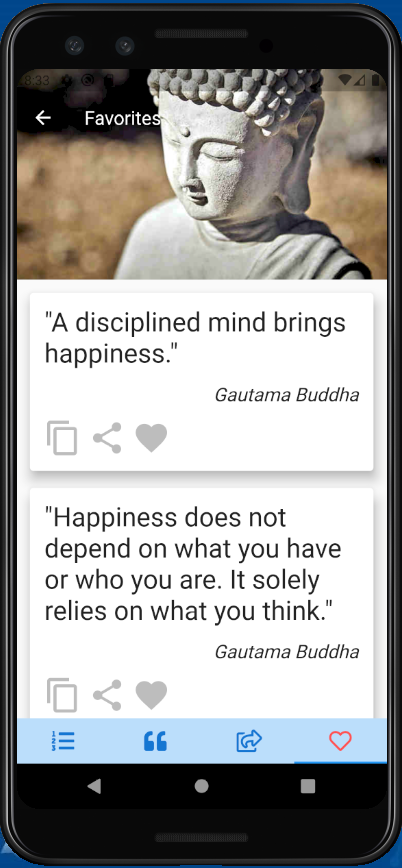

# Цитаты Будды

* Переключение языка на русский (интерфейс пока не переведен) - в lib/servoces/constants.dart установить kLang = "ru"
* Управление состоянием - MobX
* Хранение данных на устройстве - SharedPreferences
* API выполнено на FastApi, лежит в папке /backend и размещено на heroku

# TODO - высокий приоритет:

* Полноценная локализация ru/en
* Подключение AdMob, Sentry, аналитики
* Выкладывание в маркет ru и en версий
* Кеширование запросов к сети
* Подгрузка всех картинок из веба, их кеширование и хранение на устройстве 

# Демонстрация работы на эмуляторе:

# Основные экраны

  
   
  
  
  
  
  
  
  

